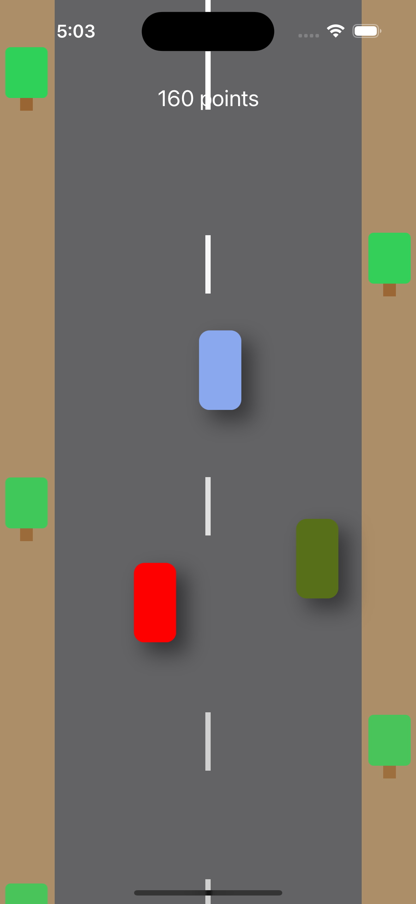

# Velocity Rush

Velocity Rush is an exciting mobile racing game that challenges players to race against time and beat their own records. The game offers various customization options and control methods to enhance the gaming experience.

## Screens

### 1. Start Screen

The start screen serves as the main menu for the game. It provides the following options:

- Start the game
- Open settings
- Open the list of records

### 2. Settings Screen

The settings screen allows players to customize their gameplay experience. It includes the following options:

- Edit the user profile: Name and photo (choose from the gallery or take a photo using the camera)
- Change the color of the player's car
- Modify the appearance of obstacles on the side of the road
- Select the game difficulty (easy, medium, or hard)
- Choose the method of controlling the car (buttons, swipes, or accelerometer)

### 3. Records Screen

The records screen displays the list of saved records. It provides the following features:

- List of records, showing the player's name and their corresponding scores
- Ability to delete records

## Screenshots

## Requirements

- iOS 14.0+
- Xcode 12.0+
- Swift 5.0+

## Installation

1. Clone the repository:

git clone git@github.com:your-username/FactorialCalculator.git

3. Open the project in Xcode.

4. Build and run the app on the iOS simulator or a physical device.

## Contributing

Contributions are welcome! If you have any ideas, suggestions, or bug reports, please open an issue or submit a pull request.

## License

This project is licensed under the [MIT License](LICENSE).
